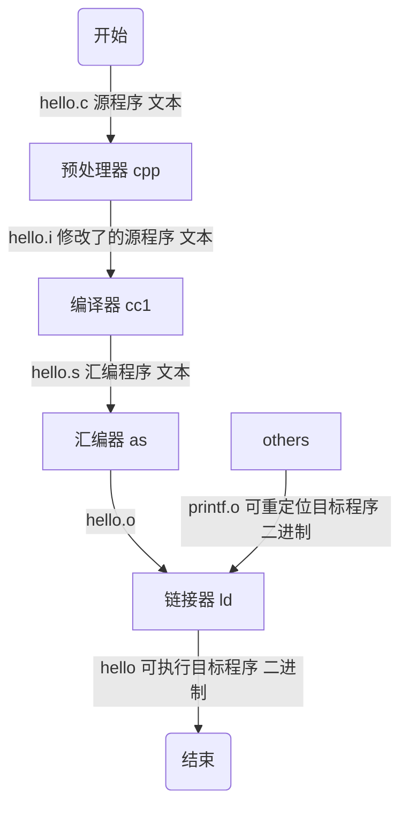

# 基础概念

## 编译器驱动程序

编译器驱动程序(compiler driver)，代表用户在需要时调用语言预处理器、编译器、汇编器和链接器。生成可执行目标文件的过程如下：

生成可执行文件后，在 shell 中输入`./hello`，shell 通过调用某个驻留在存储器中成为加载器（loader）的操作系统代码来运行它

## 字节序 Endianness

字节序，也就是字节的顺序，指的是多字节的数据在内存中的存放顺序；在内存中，数据是以字节（8bit）存储的，当存储 16bit 或者 32bit 时，就面临着大端 （Big-Endian）存储， 还是小端 （Little-Endian） 存储的问题。

字节序只和处理器架构有关

### 大端 Big-Endian

大端存储：高字节存储在低地址中，即高位先存

#### 数据以 8bit 为单位

| 地址增长方向 -> | | | | | |
| :--: | :--: | :--: | :--: | :--: | :--: |
| ... | 0x0A | 0x0B | 0x0C | 0x0D | ... |

示例中，最高位字节是 0x0A 存储在最低的内存地址处。下一个字节 0x0B 存在后面的地址处。正类似于十六进制字节从左到右的阅读顺序

#### 数据以 16bit 为单位

| 地址增长方向 -> | | | |
| :--: | :--: | :--: | :--: |
| ... | 0x0A0B | 0x0C0D | ... |

最高的 16bit 单元 0x0A0B 存储在低位

### 小端 Little-Endian

小端存储：低字节存储在低地址中，即低位先存

#### 数据以 8bit 为单位

| 地址增长方向 -> | | | | | |
| :--: | :--: | :--: | :--: | :--: | :--: |
| ... | 0x0D | 0x0C | 0x0B | 0x0A | ... |

最低位字节是 0x0D 存储在最低的内存地址处。后面字节依次存在后面的地址处

#### 数据以 16bit 为单位

| 地址增长方向 -> | | | |
| :--: | :--: | :--: | :--: |
| ... | 0x0C0D | 0x0A0B | ... |

最低的 16bit 单元 0x0C0D 存储在低位

# 参考链接

1. [链接器、链接过程及相关概念解析](https://blog.csdn.net/yueguangmuyu/article/details/116710102)
