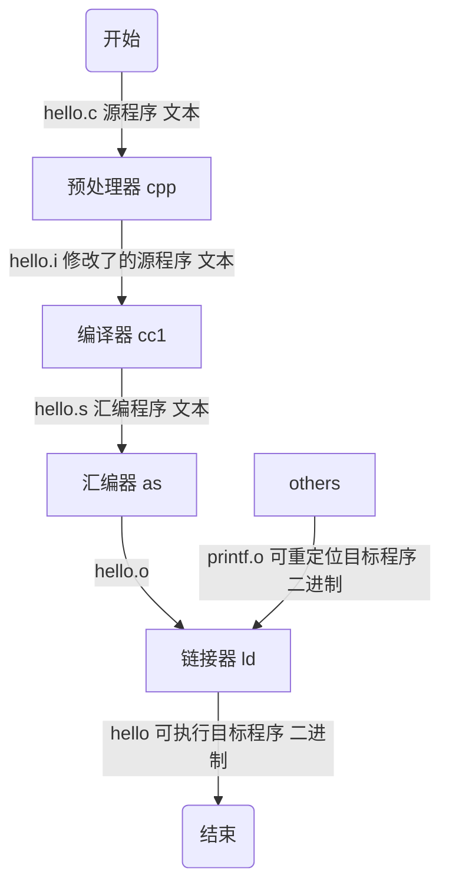

# 基础概念

## 编译器驱动程序

编译器驱动程序(compiler driver)，代表用户在需要时调用语言预处理器、编译器、汇编器和链接器。生成可执行目标文件的过程如下：

生成可执行文件后，在 shell 中输入`./hello`，shell 通过调用某个驻留在存储器中成为加载器（loader）的操作系统代码来运行它

# 参考链接

1. [链接器、链接过程及相关概念解析](https://blog.csdn.net/yueguangmuyu/article/details/116710102)
