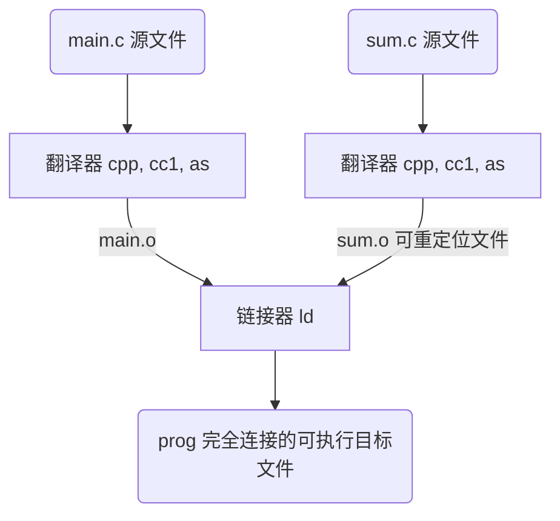
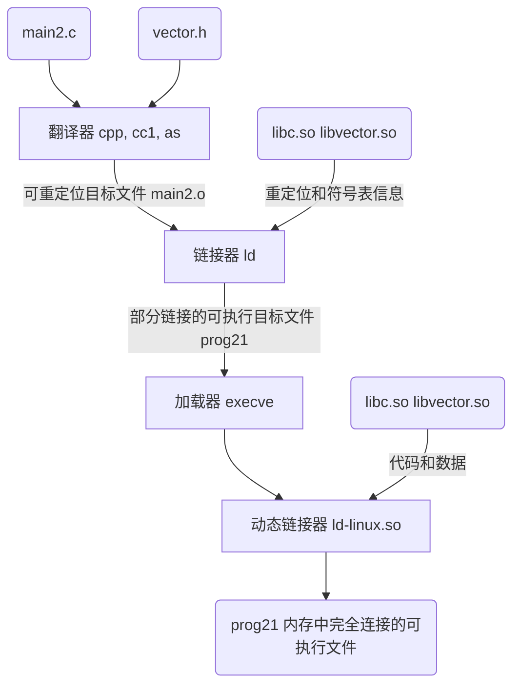
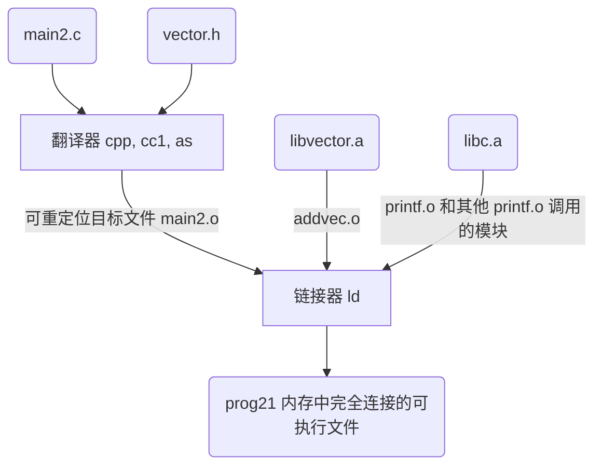

# LINKER 基础

## 链接

链接由链接器(linker)程序执行，链接执行的时机有：

* **编译时(compile time)**：源代码被翻译成机器码。静态库，共享库(动态库)，可重定位目标文件
* **加载时(load time)**：程序被加载器(loader)加载到内存并执行时。静态库，共享库(动态库)，可重定位目标文件
* **运行时(run time)**：由应用程序来执行链接。共享库(动态库)/共享目标文件

### 静态链接过程

## 目标文件

目标文件有三种形式：

* **可重定位目标文件**：包含二进制代码和数据，其形式可以在编译时与其他可重定位目标文件合并起来，创建一个可执行目标文件。linux 下 *.o*，ms 下 *.lib*
* **可执行目标文件**：包含二进制代码和数据，其形式可以被直接复制到内存并执行
* **共享目标文件**：一种特殊类型的可重定位目标文件，可以在加载或者运行时被动态地加载进内存并链接，linux 下 *.so*，ms 下 *.dll*

**目标模块(object module)**就是一个字节序列，而**目标文件(object file)**就是一个以文件形式存放在磁盘中的目标模块。两者在许多情况下是可以互换的，一般来说目标文件可以包含多个目标模块

### 可重定位目标文件(.o)

### 可执行目标文件(无后缀)

#### 典型的 ELF 可执行目标文件的格式

即文本源程序通过编译器、汇编器和链接器之后得到的可执行目标文件(二进制文件)，该文件包含加载程序到内存并运行的所需的所有信息

其中，ELF 可执行文件被设计得很容易加载到内存，可执行文件的连续的片(chunk)被映射到连续的内存段。程序头部表(program header table)描述了这种映射关系

#### 加载可执行目标文件

正如[编译器驱动程序](basis.md)中图片后内容所说 shell 调用某个驻留在存储器中的加载器的 OS 代码来执行可执行目标文件。任何 Linux 程序都可以通过调用 execve 函数来调用加载器。加载器将可执行目标文件中的代码和数据从磁盘复制到内存中，然后通过跳转到程序的第一条指令或入口点来运行该程序。这个将程序复制到内存并运行的过程叫做**加载**

每个 Linux 程序运行时都会有一个**内存映像(memory snapshot)**

### 共享目标文件(.dll 和 .so)

静态库(`.lib`和`.a`)需要定期维护和更新，更新时需要重新进行编译和链接，费时费力；同时对于`libc.a`这样的标准 C 静态库被几乎所有的源程序所链接使用，其中的目标模块的代码会被复制到每个运行进程的文本块当中，将是对稀缺的内存系统资源的极大浪费

针对静态库的这些缺陷，出现了 **共享库(shared library)** 这一产物，其也是一目标模块，在运行或加载时，可加载到任意的内存地址，并和一个在内存中的程序链接起来。这一过程称为 **动态链接(dynamic linking)**，由动态链接器(dynamic linker)程序来执行。共享库也称为共享目标(shared object)，Linux下后缀为`.so`，MS下后缀为`.dll`

共享库进行共享的两种方式：

* 在任何给定的文件系统中，对于一个库只有一个 `.so` 文件。所有引用该库的可执行目标文件共享这个文件中的代码和数据，而不是像静态库的内容那样被复制和嵌入到引用它们的可执行的文件中
* 在内存中，一个共享库的 `.text` 节的一个副本可以被不同的正在运行的进程共享

#### 链接器动态链接共享库

链接器动态链接共享库的行为过程如下图所示

当加载器加载和运行可执行文件 prog21 时，先加载部分链接的可执行文件 prog21。接着，它注意到 prog21 包含一个 .interp 节，这一节包含动态链接器的路径名，动态链接器本身就是一个共享目标（如在 Linux 系统上的 *ld−linux.so*)，加载器不会像它通常所做地那样将控制传递给应用，而是加载和运行这个动态链接器。然后，动态链接器通过执行下面的重定位完成链接任务：

* 重定位`libc.so`的文本和数据到某个内存段
* 重定位`libvector.so`的文本和数据到另一个内存段
* 重定位`prog21`中所有对由`libc.so`和`libvector.so`定义的符号的引用

最后，动态链接器将控制传递给应用程序。从这个时刻开始，共享库的位置就固定了，并且在程序执行的过程中都不会改变

#### 应用程序加载和链接共享库

Linux 系统为动态链接器提供了一个简单的接口，允许应用程序在运行时加载和链接共享库

* **dlopen 函数**加载和链接共享库 filename
* **dlsym 函数**的输人是一个指向前面已经打开了的共享库的句柄和一个 symbol 名字,如果该符号存在，就返回符号的地址，否则返回 NULL
* **dlerror 函数**返回一个字符串，它描述的是调用dlopen、 dlsym 或者dlclose 函数时发生的最近的错误，如果没有错误发生，就返回NULL

## 链接器任务

### 符号解析(symbol resolution)

目标文件定义和符号引用，每个符号应当对应于一个符号定义，或许是一个函数、全局变量或静态变量(即C语言中以static属性声明的变量)，**符号解析的目的是将每个符号引用和相应的符号定义关联起来**

#### 符号和符号表

每个可重定位目标模块 m 都有一个符号表 .symtab，它包含 m 定义和引用的符号信息（该表不包含对应于本地非静态程序变量的任何符号，即不加 static 修饰的局部变量，这些变量保存在运行时栈当中进行管理）。在链接器的上下文中，对于目标模块 m 而言有三种不同符号：

* 由模块 m 定义并能被其他模块引用的全局符号。**全局链接器符号**对应于非静态的 C 函数和全局变量
* 由其他模块定义并被模块 m 引用的全局符号。这些符号称为**外部符号**，对应于在其他模块中定义的非静态 C 函数和全局变量
* 只被模块 m 定义和引用的**局部符号**。它们对应于带 static 属性的 C 函数和全局变量。这些符号在模块 m 中任何位置都可见，但是不能被其他模块引用

#### 符号解析

* **对局部符号的(包括定义和引用)解析**(引用和定义均在相同模块中)，符号(引用)解析相当明了，同时编译器只要确保它们拥有唯一名称即可
* **对全局符号和外部符号的引用解析**就复杂得多。当编译器遇到一个不是在当前模块中定义的符号(变量或函数名)时，会假设该符号是在其他某个模块中定义的，生成一个链接器符号表条目，并把它交给链接器处理。如果链接器在它的任何输入模块中都找不到这个被引用符号的定义，就输出一条(通常很难阅读的)错误信息并终止
* **对全局符号和外部符号的(定义)解析**很棘手，多个目标文件可能会定义相同名字的全局符号。在这种情况中，链接器必须要么标志一个错误，要么以某种方法选出一个定义并抛弃其他定义。(对于C++中的函数重载，编译器依据函数签名组合编码成一个对链接器而言唯一的名称，也称为重整(mangling)过程)

##### 链接器解析多重定义的全局符号方式

每个全局符号都区分为强弱符号，其划分依据为：函数和已初始化的全局变量是强符号；未初始化的全局变量是弱符号。根据强弱符合定义，有如下三个处理多重定义符号名的规则：

1. 不允许有多个同名的强符号，若有则报错
2. 如果有一个强符号和多个弱符号同名，那么选择强符号
3. 如果有多个弱符号同名，那么从这些弱符号中任意选择一个

其中规则2，3容易引起难以察觉的跨文件错误或重定义错误，造成编译器不报错但结果与预期不符的可怕情况

##### 与静态库(.a)链接

在**所有的编译系统都提供将所有相关的目标模块打包成一单独文件，称为静态库(static library)，也即存档文件**，静态库也可作为*链接器ld*的输入

静态库以一种称为 **存档(archive)** 的特殊文件格式存放在磁盘中，其有头部来描述每个成员目标文件的大小和位置，文件名由后缀 .a 标示

当链接器构造一个输出的可执行文件时，它只复制静态库里被应用程序引用的目标模块。静态库提出以解决 *让编译器认出对函数的调用造成的符号解析复杂的问题* 和 *将所有标准C函数放在单独可重定位目标模块再引入造成的内存空间浪费的问题*

链接器链接可重定位目标文件和静态库的行为过程如下图所示

##### 链接器使用静态库的解析引用

在符号解析阶段，链接器从左到右按照它们在编译器驱动程序命令行上出现的顺序来扫描可重定位目标文件和存档文件。在扫描中，链接器维护三个集合，初始时三个集合均为空：

* **可重定位目标文件的集合E(Executable)**(这个集合中的文件会被合并起来形成可执行文件)
* **未解析的符号集合U(Unresolved)**(即引用了但尚未定义的符号)
* **已定义的符号集合D(Defined)**(在前面输入文件已定义的符号)

有了三个集合后，链接器使用如下规则解析静态库中的引用，先设定当前扫描到的文件为 f

* 对于每个 f，链接器判断 f 是目标文件还是存档文件
  * 若是目标文件，将 f 添加到 E，修改 U 和 D 来反映 f 的符号定义和引用
  * 若是存档文件，链接器尝试匹配 U 中未解析的符号和存档文件中所定义的成员符号。若某个存档文件成员 m，定义了一个符号解析 U 中的一个引用，那么将 m 加到 E 中,修改 U 和 D 来反映 f 的符号定义和引用。对 f 中的所有成员目标文件均依次进行该过程，直至 U 和 D 都不再变化。此时将不包含在 E 中的所有其他成员目标文件丢弃
* 如果当链接器完成命令行上输入文件的扫描后，U 是非空的，那么链接器就会输出一个错误并终止。否则，它会合并和重定位 E 中的目标文件，构建输出的可执行文件

### 重定位(relocation)

符号解析是将符号引用和其定义关联起来，从而链接器就知道它的输入目标模块中的代码节和数据节的确切大小了。而**重定位是把每个符号定义与一个内存位置关联起来，进而修改所有对这些符号的引用，使得它们指向这个内存位置**

#### 重定位条目

当汇编器(as)生成一个目标模块时，它并不知道数据和代码最终将放在内存中的什么位置，也不知道这个模块引用的任何外部定义的函数或者全局变量的位置。当汇编器遇到以上情况，就会生成一个重定位条目，以告知链接器在将目标文件合并成可执行文件时如何修改该引用。代码的重定向条目放在`.rel.text`中，已初始化数据的重定位条目放在`.rel.data`中

#### 重定位

在重定位过程中，由两步组成

1. **重定位节和符号定义**：在这一步中，链接器将所有相同类型的节合并为同一类型的新的聚合节
2. **重定位节中的符号引用**：在这一步中，链接器修改代码节和数据节中对每个符号的引用，使得它们指向正确的运行时地址。要执行这一步，链接器依赖于可重定位目标模块中称为重定位条目的数据结构

在重定位算法当中，链接器遍历每个节，同时遍历每个节中的重定位条目，依据重定位条目中的类型(相对寻址/绝对寻址)决定如何对重定位内容进行运行时内存地址的指定

## 符号决议

链接器其中一项任务就是要确保提供给链接器进行链接的目标文件集合之间依赖是成立的（也就是说，不会出现在被依赖的模块中链接器找不到需要的接口），这就是后面我们要讲到的**符号决议(Symbol Resolution)**

局部变量不放入目标文件的数据段中（局部变量是函数私有的，局部变量只能在该函数内部使用而全局变量时没有这个限制的，所以函数私有的局部变量被放在了代码段中，作为机器指令的操作数）

**编译器在遇到外部定义的全局变量或者函数时只要能在当前文件找到其声明，编译器就认为编译正确。而寻找使用变量定义的这项任务就被留给了链接器。** 链接器的其中一项任务就是要确定所使用的变量要有其唯一的定义。虽然编译器给链接器留了一项任务，但为了让链接器工作的轻松一点编译器还是多做了一点工作的，这部分工作就是符号表(Symbol table)

### 符号表

符号表中保存的信息有两部分：

* 该目标文件中**引用**的全局变量以及函数
* 该目标文件中**定义**的全局变量以及函数

整个符号表只想表达两件事：

* 我能提供给其它文件使用的符号
* 我需要其它文件提供给我使用的符号

#### 符号表存放在哪里

在目标文件里有什么这一小节中，我们将一个目标文件简单的划分了两段，数据段和代码段，现在我们要向目标文件中再添加一段，而符号表也被编译器很贴心的放在目标文件中，因此一个目标文件可以理解为如图所示的三段，而符号表中的内容就是上一节当中编译器统计的表格

| 目标文件 |
| :--: |
| 数据段 |
| 代码段 |
| 符号表 |

# 多文件链接

to be continued...

# 参考链接

1. [链接器、链接过程及相关概念解析](https://blog.csdn.net/yueguangmuyu/article/details/116710102)
2. [彻底理解链接器 1](https://zhuanlan.zhihu.com/p/369036368)
3. [彻底理解链接器 2](https://zhuanlan.zhihu.com/p/369039101)