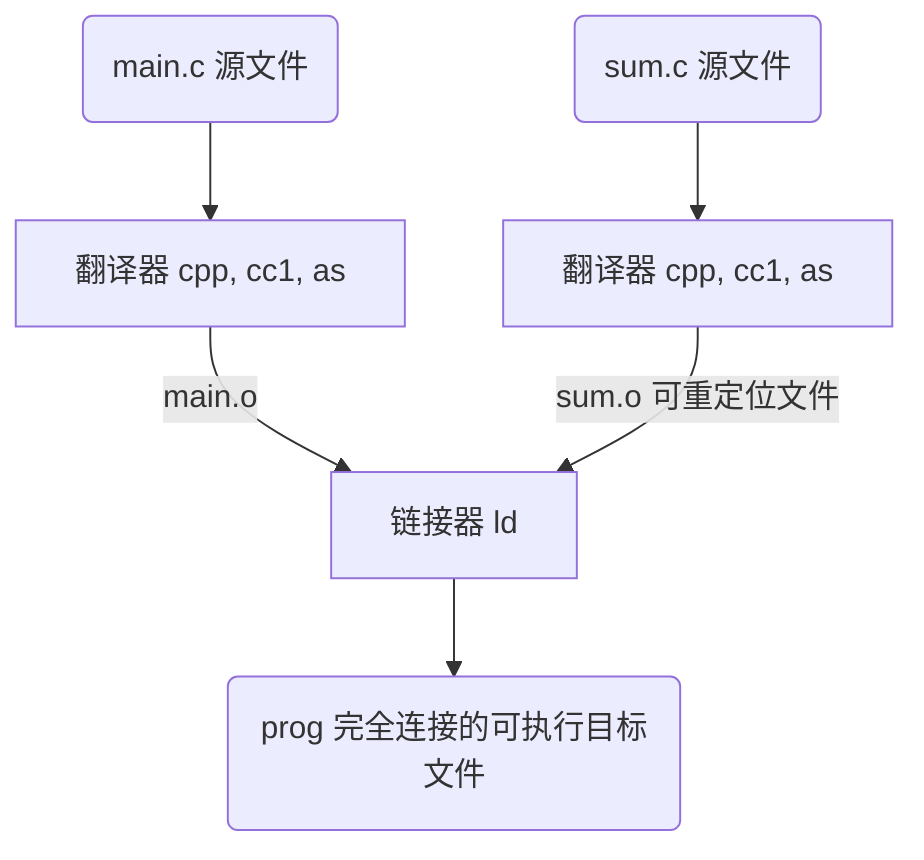
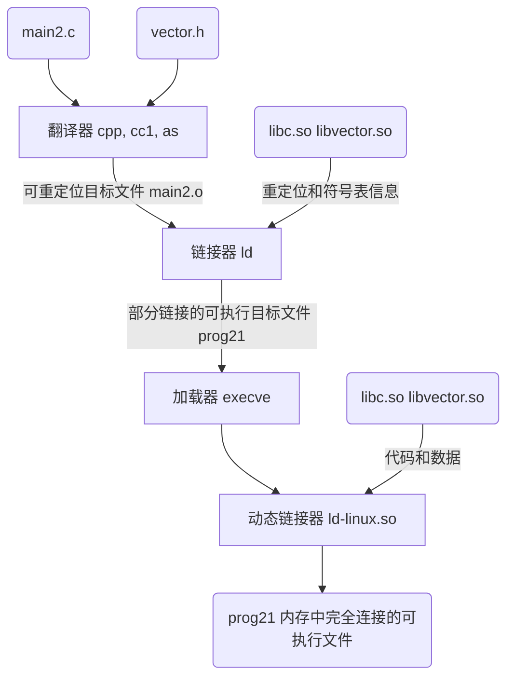
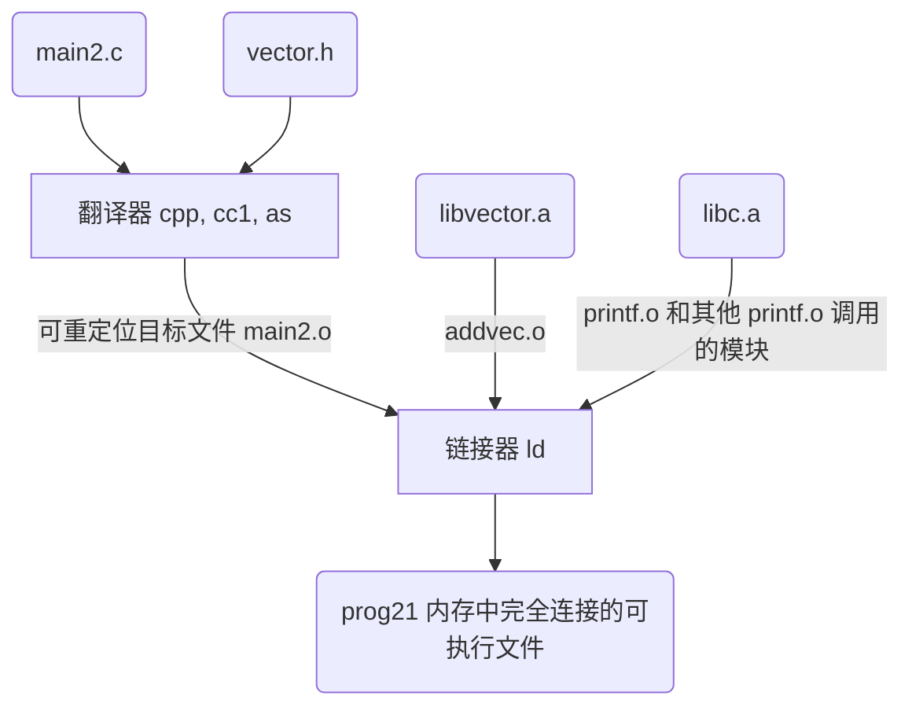
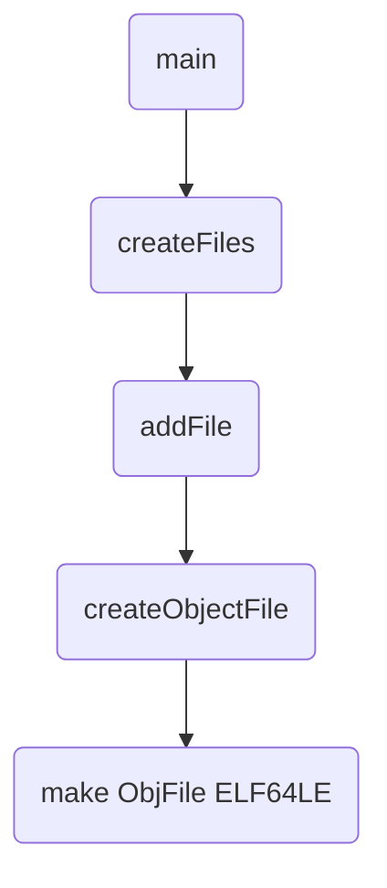

# LINKER 基础

## 链接

链接由链接器(linker)程序执行，链接执行的时机有：

* **编译时(compile time)**：源代码被翻译成机器码。静态库，共享库(动态库)，可重定位目标文件
* **加载时(load time)**：程序被加载器(loader)加载到内存并执行时。静态库，共享库(动态库)，可重定位目标文件
* **运行时(run time)**：由应用程序来执行链接。共享库(动态库)/共享目标文件

### 静态链接过程



## 目标文件

目标文件有三种形式：

* **可重定位目标文件**：包含二进制代码和数据，其形式可以在编译时与其他可重定位目标文件合并起来，创建一个可执行目标文件。linux 下 *.o*，ms 下 *.lib*
* **可执行目标文件**：包含二进制代码和数据，其形式可以被直接复制到内存并执行
* **共享目标文件**：一种特殊类型的可重定位目标文件，可以在加载或者运行时被动态地加载进内存并链接，linux 下 *.so*，ms 下 *.dll*

**目标模块(object module)**就是一个字节序列，而**目标文件(object file)**就是一个以文件形式存放在磁盘中的目标模块。两者在许多情况下是可以互换的，一般来说目标文件可以包含多个目标模块

### 可重定位目标文件(.o)

### 可执行目标文件(无后缀)

#### 典型的 ELF 可执行目标文件的格式

即文本源程序通过编译器、汇编器和链接器之后得到的可执行目标文件(二进制文件)，该文件包含加载程序到内存并运行的所需的所有信息

其中，ELF 可执行文件被设计得很容易加载到内存，可执行文件的连续的片(chunk)被映射到连续的内存段。程序头部表(program header table)描述了这种映射关系

#### 加载可执行目标文件

正如[编译器驱动程序](basis.md)中图片后内容所说 shell 调用某个驻留在存储器中的加载器的 OS 代码来执行可执行目标文件。任何 Linux 程序都可以通过调用 execve 函数来调用加载器。加载器将可执行目标文件中的代码和数据从磁盘复制到内存中，然后通过跳转到程序的第一条指令或入口点来运行该程序。这个将程序复制到内存并运行的过程叫做**加载**

每个 Linux 程序运行时都会有一个**内存映像(memory snapshot)**

### 共享目标文件(.dll 和 .so)

静态库(`.lib`和`.a`)需要定期维护和更新，更新时需要重新进行编译和链接，费时费力；同时对于`libc.a`这样的标准 C 静态库被几乎所有的源程序所链接使用，其中的目标模块的代码会被复制到每个运行进程的文本块当中，将是对稀缺的内存系统资源的极大浪费

针对静态库的这些缺陷，出现了 **共享库(shared library)** 这一产物，其也是一目标模块，在运行或加载时，可加载到任意的内存地址，并和一个在内存中的程序链接起来。这一过程称为 **动态链接(dynamic linking)**，由动态链接器(dynamic linker)程序来执行。共享库也称为共享目标(shared object)，Linux下后缀为`.so`，MS下后缀为`.dll`

共享库进行共享的两种方式：

* 在任何给定的文件系统中，对于一个库只有一个 `.so` 文件。所有引用该库的可执行目标文件共享这个文件中的代码和数据，而不是像静态库的内容那样被复制和嵌入到引用它们的可执行的文件中
* 在内存中，一个共享库的 `.text` 节的一个副本可以被不同的正在运行的进程共享

#### 链接器动态链接共享库

链接器动态链接共享库的行为过程如下图所示



当加载器加载和运行可执行文件 prog21 时，先加载部分链接的可执行文件 prog21。接着，它注意到 prog21 包含一个 .interp 节，这一节包含动态链接器的路径名，动态链接器本身就是一个共享目标（如在 Linux 系统上的 *ld−linux.so*)，加载器不会像它通常所做地那样将控制传递给应用，而是加载和运行这个动态链接器。然后，动态链接器通过执行下面的重定位完成链接任务：

* 重定位`libc.so`的文本和数据到某个内存段
* 重定位`libvector.so`的文本和数据到另一个内存段
* 重定位`prog21`中所有对由`libc.so`和`libvector.so`定义的符号的引用

最后，动态链接器将控制传递给应用程序。从这个时刻开始，共享库的位置就固定了，并且在程序执行的过程中都不会改变

#### 应用程序加载和链接共享库

Linux 系统为动态链接器提供了一个简单的接口，允许应用程序在运行时加载和链接共享库

* **dlopen 函数**加载和链接共享库 filename
* **dlsym 函数**的输人是一个指向前面已经打开了的共享库的句柄和一个 symbol 名字,如果该符号存在，就返回符号的地址，否则返回 NULL
* **dlerror 函数**返回一个字符串，它描述的是调用dlopen、 dlsym 或者dlclose 函数时发生的最近的错误，如果没有错误发生，就返回NULL

## 链接器任务

### 符号解析(symbol resolution)

目标文件定义和符号引用，每个符号应当对应于一个符号定义，或许是一个函数、全局变量或静态变量(即C语言中以static属性声明的变量)，**符号解析的目的是将每个符号引用和相应的符号定义关联起来**

#### 符号和符号表

每个可重定位目标模块 m 都有一个符号表 .symtab，它包含 m 定义和引用的符号信息（该表不包含对应于本地非静态程序变量的任何符号，即不加 static 修饰的局部变量，这些变量保存在运行时栈当中进行管理）。在链接器的上下文中，对于目标模块 m 而言有三种不同符号：

* 由模块 m 定义并能被其他模块引用的全局符号。**全局链接器符号**对应于非静态的 C 函数和全局变量
* 由其他模块定义并被模块 m 引用的全局符号。这些符号称为**外部符号**，对应于在其他模块中定义的非静态 C 函数和全局变量
* 只被模块 m 定义和引用的**局部符号**。它们对应于带 static 属性的 C 函数和全局变量。这些符号在模块 m 中任何位置都可见，但是不能被其他模块引用

#### 符号解析

* **对局部符号的(包括定义和引用)解析**(引用和定义均在相同模块中)，符号(引用)解析相当明了，同时编译器只要确保它们拥有唯一名称即可
* **对全局符号和外部符号的引用解析**就复杂得多。当编译器遇到一个不是在当前模块中定义的符号(变量或函数名)时，会假设该符号是在其他某个模块中定义的，生成一个链接器符号表条目，并把它交给链接器处理。如果链接器在它的任何输入模块中都找不到这个被引用符号的定义，就输出一条(通常很难阅读的)错误信息并终止
* **对全局符号和外部符号的(定义)解析**很棘手，多个目标文件可能会定义相同名字的全局符号。在这种情况中，链接器必须要么标志一个错误，要么以某种方法选出一个定义并抛弃其他定义。(对于C++中的函数重载，编译器依据函数签名组合编码成一个对链接器而言唯一的名称，也称为重整(mangling)过程)

##### 链接器解析多重定义的全局符号方式

每个全局符号都区分为强弱符号，其划分依据为：函数和已初始化的全局变量是强符号；未初始化的全局变量是弱符号。根据强弱符合定义，有如下三个处理多重定义符号名的规则：

1. 不允许有多个同名的强符号，若有则报错
2. 如果有一个强符号和多个弱符号同名，那么选择强符号
3. 如果有多个弱符号同名，那么从这些弱符号中任意选择一个

其中规则2，3容易引起难以察觉的跨文件错误或重定义错误，造成编译器不报错但结果与预期不符的可怕情况

##### 与静态库(.a)链接

在**所有的编译系统都提供将所有相关的目标模块打包成一单独文件，称为静态库(static library)，也即存档文件**，静态库也可作为*链接器ld*的输入

静态库以一种称为 **存档(archive)** 的特殊文件格式存放在磁盘中，其有头部来描述每个成员目标文件的大小和位置，文件名由后缀 .a 标示

当链接器构造一个输出的可执行文件时，它只复制静态库里被应用程序引用的目标模块。静态库提出以解决 *让编译器认出对函数的调用造成的符号解析复杂的问题* 和 *将所有标准C函数放在单独可重定位目标模块再引入造成的内存空间浪费的问题*

链接器链接可重定位目标文件和静态库的行为过程如下图所示



##### 链接器使用静态库的解析引用

在符号解析阶段，链接器从左到右按照它们在编译器驱动程序命令行上出现的顺序来扫描可重定位目标文件和存档文件。在扫描中，链接器维护三个集合，初始时三个集合均为空：

* **可重定位目标文件的集合E(Executable)**(这个集合中的文件会被合并起来形成可执行文件)
* **未解析的符号集合U(Unresolved)**(即引用了但尚未定义的符号)
* **已定义的符号集合D(Defined)**(在前面输入文件已定义的符号)

有了三个集合后，链接器使用如下规则解析静态库中的引用，先设定当前扫描到的文件为 f

* 对于每个 f，链接器判断 f 是目标文件还是存档文件
  * 若是目标文件，将 f 添加到 E，修改 U 和 D 来反映 f 的符号定义和引用
  * 若是存档文件，链接器尝试匹配 U 中未解析的符号和存档文件中所定义的成员符号。若某个存档文件成员 m，定义了一个符号解析 U 中的一个引用，那么将 m 加到 E 中,修改 U 和 D 来反映 f 的符号定义和引用。对 f 中的所有成员目标文件均依次进行该过程，直至 U 和 D 都不再变化。此时将不包含在 E 中的所有其他成员目标文件丢弃
* 如果当链接器完成命令行上输入文件的扫描后，U 是非空的，那么链接器就会输出一个错误并终止。否则，它会合并和重定位 E 中的目标文件，构建输出的可执行文件

### 重定位(relocation)

符号解析是将符号引用和其定义关联起来，从而链接器就知道它的输入目标模块中的代码节和数据节的确切大小了。而**重定位是把每个符号定义与一个内存位置关联起来，进而修改所有对这些符号的引用，使得它们指向这个内存位置**

#### 重定位条目

当汇编器(as)生成一个目标模块时，它并不知道数据和代码最终将放在内存中的什么位置，也不知道这个模块引用的任何外部定义的函数或者全局变量的位置。当汇编器遇到以上情况，就会生成一个重定位条目，以告知链接器在将目标文件合并成可执行文件时如何修改该引用。代码的重定向条目放在`.rel.text`中，已初始化数据的重定位条目放在`.rel.data`中

#### 重定位

在重定位过程中，由两步组成

1. **重定位节和符号定义**：在这一步中，链接器将所有相同类型的节合并为同一类型的新的聚合节
2. **重定位节中的符号引用**：在这一步中，链接器修改代码节和数据节中对每个符号的引用，使得它们指向正确的运行时地址。要执行这一步，链接器依赖于可重定位目标模块中称为重定位条目的数据结构

在重定位算法当中，链接器遍历每个节，同时遍历每个节中的重定位条目，依据重定位条目中的类型(相对寻址/绝对寻址)决定如何对重定位内容进行运行时内存地址的指定

## 符号决议

链接器其中一项任务就是要确保提供给链接器进行链接的目标文件集合之间依赖是成立的（也就是说，不会出现在被依赖的模块中链接器找不到需要的接口），这就是后面我们要讲到的**符号决议(Symbol Resolution)**

局部变量不放入目标文件的数据段中（局部变量是函数私有的，局部变量只能在该函数内部使用而全局变量时没有这个限制的，所以函数私有的局部变量被放在了代码段中，作为机器指令的操作数）

**编译器在遇到外部定义的全局变量或者函数时只要能在当前文件找到其声明，编译器就认为编译正确。而寻找使用变量定义的这项任务就被留给了链接器。** 链接器的其中一项任务就是要确定所使用的变量要有其唯一的定义。虽然编译器给链接器留了一项任务，但为了让链接器工作的轻松一点编译器还是多做了一点工作的，这部分工作就是符号表(Symbol table)

### 符号表

符号表中保存的信息有两部分：

* 该目标文件中**引用**的全局变量以及函数
* 该目标文件中**定义**的全局变量以及函数

整个符号表只想表达两件事：

* 我能提供给其它文件使用的符号
* 我需要其它文件提供给我使用的符号

#### 符号表存放在哪里

在目标文件里有什么这一小节中，我们将一个目标文件简单的划分了两段，数据段和代码段，现在我们要向目标文件中再添加一段，而符号表也被编译器很贴心的放在目标文件中，因此一个目标文件可以理解为如图所示的三段，而符号表中的内容就是上一节当中编译器统计的表格

| 目标文件 |
| :--: |
| 数据段 |
| 代码段 |
| 符号表 |

## 动态链接

对于静态链接的可执行文件来说，整个进程只有一个文件要被映射，即可执行文件。而对于动态链接，除了可执行文件，还有它所依赖的共享目标文件

关于共享目标文件在内存中的地址分配，主要有两种解决方案，分别是：

* 静态共享库（Static Shared Library）：地址固定
* 动态共享库（Dynamic Shared Libary）：地址不固定

### 静态共享库

静态共享库的做法是将程序的各个模块统一交给操作系统进行管理，操作系统在某个特定的地址划分出一些地址块，为那些已知的模块预留足够的空间。因为这个地址对于不同的应用程序来说，都是固定的，所以称之为**静态**

静态共享库的目标地址会导致地址冲突、升级等问题

### 动态共享库

采用动态共享库的方式，也称为**装载时重定位（Load Time Relocation）**。其基本思路是：在链接时，对所有绝对地址的引用都不作重定位，而把这一步推迟到装载时再完成。一旦模块装载地址确定，即目标地址确定，那么系统就对程序中所有的绝对地址引用进行重定位

但是这种方式也存在一些问题。比如，动态链接模块被装载映射至虚拟空间后，指令部分是在多个进程间共享的，由于装载时重定位的方法需要修改指令，所以没有办法做到同一份指令被多个进程共享，因为指令被重定位后对于每个进程来说都是不同的

然后，动态链接库中的代码是共享的，但是其中的可修改数据部分对于不同进程来说是由多个副本的。基于此，一种名为**地址无关代码**的技术被提出以克服这个问题

**地址无关代码（PIC，Position-independent Code）** 技术完美阐释了上面这句名言，其基本原理是：把指令中那些需要被修改的部分分离出来，跟数据部分放在一起，这样指令部分就可以保持不变，而数据部分可以在每个进程中拥有一个副本

共享对象模块中的地址引用按照是否为跨模块分为两类：模块内部引用、模块外部引用。按照不用的引用方式又可分为：指令引用、数据引用。以如下代码为例，可得出如下四种类型：

* 类型1：模块内部的函数调用
* 类型2：模块内部的数据访问，如模块中定义的全局变量、静态变量
* 类型3：模块外部的函数调用
* 类型4：模块外部的数据访问，如其他模块中定义的全局变量

```c
static int a;
extern int b;
extern void ext();

void bar() {
    a = 1;      // 类型2：模块内部数据访问
    b = 2;      // 类型4：模块外部数据访问
}

void foo() {
    bar();      // 类型1：模块内部函数调用
    ext();      // 类型4：模块外部函数调用
}
```

#### 类型1 模块内部函数调用

由于被调用的函数与调用者都处于同一模块，它们之间的相对位置是固定的。对于现代的系统来说，模块内部的调用都可以是相对地址调用，或者是基于寄存器的相对调用，所以对于这种指令是不需要重定位的

#### 类型2 模块内部数据访问

一个模块前面一般是若干个页的代码，后面紧跟着若干个页的数据，这些页之间的相对位置是固定的，即任何一条指令与它需要访问的模块内部数据之间的相对位置是固定的，所以只需要相对于当前指令加上固定的偏移量就可以访问模块内部数据了

#### 类型3 模块间数据访问

模块间的数据访问比模块内部稍微麻烦一些，因为模块间的数据访问目标地址要等到装载时才决定。此时，动态链接需要使用代码无关地址技术，其基本思想是把地址相关的部分放到数据段。ELF的实现方法是：在数据段中建立一个**指向这些变量的指针数组**，也称为**全局偏移表（Global Offset Table，GOT）**，当代码需要引用该全局变量时，可以通过GOT中相对应的项间接引用

当指令中需要访问变量b时，程序会先找到GOT，然后根据GOT中变量所对应的项找到变量的目标地址。每个变量都对应一个4字节的地址，链接器在装载模块时会查找每个变量所在的地址，然后填充GOT中的各个项，以确保每个指针所指向的地址正确。由于GOT本身是放在数据段的，所以它可以**在模块装载时被修改**，并且每个进程都可以有独立的副本，相互不受影响

#### 类型4 模块间函数调用

对于模块间函数调用，同样可以采用类型3的方法来解决。与上面的类型有所不同的是，GOT中响应的项保存的是目标函数的地址，当模块需要调用目标函数时，可以通过GOT中的项进行间接跳转

### load-time dynamic linking 加载时动态链接

#### 阶段一 将动态库信息写入可执行文件

在编译链接生成可执行文件时，需要将使用的动态库加入到链接选项当中，比如在Linux下引用libMath.so，就需要将libMath.so加入到链接选项当中（比如libMath.so放到了/usr/lib下，那么使用命令 gcc ... -lMath -L/user/lib ... 进行编译链接），所以使用这种方式生成的可执行文件中保存了依赖的动态库信息，在Linux可使用一个简单的命令ldd来查看。

#### 阶段二 加载可执行文件时依据动态库信息进行动态链接

由于在阶段一生成的可执行文件中保存了动态库信息，当可执行文件加载完成后，就可以依据此信息进行中动态库的查找以及符号决议了。

通过这个过程也可以清楚的看到静态库和动态库的区别，使用动态库的可执行文件当中仅仅保留相应信息，动态库的链接过程被推迟到了程序启动加载时。

### run-time dynamic linking 运行时动态链接

运行时动态链接不需要在编译链接时提供动态库信息，也就是说，在可执行文件被启动运行之前，可执行文件对所依赖的动态库信息一无所知，只有当程序运行到需要调用动态库所提供的代码时才会启动动态链接过程。

我们在上一节中介绍了load-time，也就是程序加载时，那么程序加载完成后就开始程序执行了，那么所谓run-time(运行时)指的就是从程序开始被CPU执行到程序执行完成退出的这段时间。

由于在编译链接生成可执行文件的过程中没有提供所依赖的动态库信息，因此这项任务就留给了程序员，在代码当中如果需要使用某个动态库所提供的函数，我们可以使用特定的API来运行时加载动态库，在Windows下通过LoadLibrary或者LoadLibraryEx，在Linux下通过使用dlopen、dlsym、dlclose这样一组函数在运行时链接动态库。当这些API被调用后，同样是首先去找这些动态库，将其从磁盘copy到内存，然后查找程序依赖的函数是否在动态库中定义。这些过程完成后动态库中的代码就可以被正常使用了。

# 符号

## 弱符号

### 弱符号定义

Weak symbols are symbols that may or may not be defined.

**The linker processes symbols that are defined with a "weak" binding differently from symbols that are defined with global binding.** Instead of including a weak symbol in the object file's symbol table (as it would for a global symbol), the linker only includes a weak symbol in the output of a "final" link if the symbol is required to resolve an otherwise unresolved reference.

This allows the linker to minimize the number of symbols it includes in the output file's symbol table by omitting those that are not needed to resolve references. **Reducing the size of the output file's symbol table reduces the time required to link, especially if there are a large number of pre-loaded symbols to link against.** This feature is particularly helpful for OpenCL applications.

### 弱符号处理

The linker uses the following guidelines to determine which definition is used when resolving references to a symbol:

* A strongly bound symbol always takes precedence over a weakly bound symbol.
* If two symbols are both strongly bound or both weakly bound, a symbol defined in a linker command file takes precedence over a symbol defined in an input object file.
* If two symbols are both strongly bound and both are defined in an input object file, the linker provides a symbol redefinition error and halts the link process.

对于 C/C++ 语言来说，编译器默认函数和初始化了的全局变量为强符号，未初始化的全局变量为弱符号。

注意，强符号和弱符号都是针对定义来说的，不是针对符号的引用。比如我们有下面这段程序：

```cpp
extern int ext;
int weak;
int strong = 1;
__attribute__((weak)) weak2 = 2;
int main()
{
  return 0;
}
```

上面这段程序中，"weak" 和 "weak2" 是弱符号，"strong" 和 "main" 是强符号，而 "ext" 既非强符号也非弱符号，因为它是一个外部变量的引用。

针对强弱符号的概念，链接器就会按如下规则处理与选择被多次定义的全局符号：

* 规则1：不允许强符号被多次定义（即不同的目标文件中不能有同名的强符号）；如果有多个强符号定义，则链接器报符号重复定义错误。
* 规则2：如果一个符号在某个目标文件中是强符号，在其他文件中都是弱符号，那么选择强符号。
* 规则3：如果一个符号在所有目标文件中都是弱符号，那么选择其中占用空间最大的一个。比如目标文件A定义全局变量global为int型，占4个字节；目标文件B定义global为double型，占8个字节，那么目标文件A和B链接后，符号global占8个字节（尽量不要使用多个不同类型的弱符号，否则容易导致很难发现的程序错误）。

### 弱符号作用

A replaceable definition can be declared weak. A STB_GLOBAL definition from another translation unit can override it. This is a great way providing a default/fallback definition in a library which can be redefined by applications.

```cpp
// lib.cc
__attribute__((weak)) void fun() {
  ...
}

void feature() {
  fun();
}

// app.cc - override the default implementation
void fun() {
  ...
}
```

### 弱引用

目前我们所看到的对外部目标文件的符号引用在目标文件被最终链接成可执行文件时，它们须要被正确决议，如果没有找到该符号的定义，链接器就会报符号未定义错误，这种被称为强引用（Strong Reference）。与之相对应还有一种弱引用（Weak Reference），在处理弱引用时，如果该符号有定义，则链接器将该符号的引用决议；如果该符号未被定义，则链接器对于该引用不报错。链接器处理强引用和弱引用的过程几乎一样，只是对于未定义的弱引用，链接器不认为它是一个错误。一般对于未定义的弱引用，链接器默认其为0，或者是一个特殊的值，以便于程序代码能够识别。

The ELF specification says "Unresolved weak symbols have a zero value." This property can be used to check whether a definition is provided. A common pattern is to implement an optional hook.

```cpp
__attribute__((weak)) void undef_weak_fun();

  if (&undef_weak_fun)
    undef_weak_fun();
```

## 参考链接

1. [Weak symbol](https://maskray.me/blog/2021-04-25-weak-symbol)

# 多文件链接

to be continued...

# GNU linker

# LLD - The LLVM Linker

## Design

### Key Concepts

#### Speed by design

For example, we do not read section contents or relocations until we need them to continue linking. When we need to do some costly operation (such as looking up a hash table for each symbol), we do it only once. We obtain a handle (which is typically just a pointer to actual data) on the first operation and use it throughout the process.

#### Efficient archive file handling

The traditional Unix linker maintains a set of undefined symbols during linking. The linker visits each file in the order as they appeared in the command line until the set becomes empty. What the linker would do depends on file type.

* If the linker visits an object file, the linker links object files to the result, and undefined symbols in the object file are added to the set.
* If the linker visits an archive file, it checks for the archive file’s symbol table and extracts all object files that have definitions for any symbols in the set.

This algorithm sometimes leads to a counter-intuitive behavior. If you give archive files before object files, nothing will happen because when the linker visits archives, there is no undefined symbols in the set. As a result, no files are extracted from the first archive file, and the link is done at that point because the set is empty after it visits one file.

Here is how LLD approaches the problem. Instead of memorizing only undefined symbols, we program LLD so that it memorizes all symbols. When it sees an undefined symbol that can be resolved by extracting an object file from an archive file it previously visited, it immediately extracts the file and links it. It is doable because LLD does not forget symbols it has seen in archive files.

### Important Data Structures

#### Symbol

This class represents a symbol. They are created for symbols in object files or archive files. The linker creates linker-defined symbols as well.

There are basically three types of Symbols: Defined, Undefined, or Lazy.

* **Defined symbols** are for all symbols that are considered as “resolved”, including real defined symbols, COMDAT symbols, common symbols, absolute symbols, linker-created symbols, etc.
* **Undefined symbols** represent undefined symbols, which need to be replaced by Defined symbols by the resolver until the link is complete.
* **Lazy symbols** represent symbols we found in archive file headers which can turn into Defined if we read archive members.

lld将符号信息分为两部分：Symbol和SymbolBody。Symbol类代表一个符号，是为目标文件或归档文件中的符号创建的。链接器也会创建链接器定义的符号。Symbol也是SymbolBody的句柄（handle），SymbolBody是真正符号数据的容器，每一个对象文件有一个对应的SymbolBody。对应一个符号名只有一个Symbol，SymbolTable保证了这种唯一性。但一个符号名可以对应多个SymbolBody，因为同一个符号可能出现在多个对象文件中。

### LLD 程序流程分析

链接过程主要由LinkerDriver程序驱动

elf LinkerDriver的功能主要包括：

1. 处理命令行选项，主要实现在readConfigs()方法中，用命令行选项的值设置Config的对应域；
2. 生成InputFile。createFiles()方法遍历命令行选项参数中指定的输入文件，调用addFile()方法为每个输入文件生成InputFile。调用过程如下图所示（仅以ELF64LE为例）：



addFile()方法首先调用readFile()将输入文件读入MemoryBufferRef。createObjectFile()以MemoryBufferRef为参数生成ObjFile（InputFile的子类），并放入Files。主要代码所示：

```cpp
void LinkerDriver::createFiles(opt::InputArgList &Args) {
…
 for (auto *Arg : Args) {
   case OPT_INPUT:
     addFile(Arg->getValue(), /*WithLOption=*/false);
…
 
void LinkerDriver::addFile(StringRef Path, bool WithLOption) {
…
 case file_magic::elf_relocatable:
   if (InLib)
     Files.push_back(make<LazyObjFile>(MBRef, "", 0));
   else
     Files.push_back(createObjectFile(MBRef));
…
InputFile *elf::createObjectFile(MemoryBufferRef MB, StringRef ArchiveName,
 uint64_t OffsetInArchive) {
…
 case ELF64LEKind:
   return make<ObjFile<ELF64LE>>(MB, ArchiveName);
…
```

Files是LinkerDriver类的私有成员变量，是InputFile类型的向量，可以动态向其中添加输入文件对象。

```cpp
std::vector<InputFile *> Files;
```

3. 完成链接功能。实际的链接功能在LinkerDriver::link()方法中完成。其中比较重要的功能首先是遍历前述InputFile向量Files，对每个输入文件调用parseFile()方法，parseFile()方法根据文件格式调用doParseFile()方法，代码如下所示：

```cpp
void elf::parseFile(InputFile *File) {
…
 case ELF64LEKind:
   doParseFile<ELF64LE>(File);
…
```

doParseFile()方法根据文件类型调用各自的parse()方法，读入并将所有符号放入符号表中，检查是否没有剩余的未定义符号，创造一个writer，并将符号表传递给writer以将结果写入文件。

```cpp
template <class ELFT> static void doParseFile(InputFile *File) {
…
 if (auto *F = dyn_cast<BinaryFile>(File)) {
   BinaryFiles.push_back(F);
   F->parse();
   return;
 }
…
 // Regular object file
 ObjectFiles.push_back(File);
 cast<ObjFile<ELFT>>(File)->parse(ComdatGroups);
}
 
template <class ELFT>
void ObjFile<ELFT>::parse(DenseSet<CachedHashStringRef> &ComdatGroups) {
 // Read a section table. JustSymbols is usually false.
 if (this->JustSymbols)
   initializeJustSymbols();
 else
   initializeSections(ComdatGroups);
 
 // Read a symbol table.
 initializeSymbols();
}
 
template <class ELFT>
void ObjFile<ELFT>::initializeSections(
DenseSet<CachedHashStringRef> &ComdatGroups) {
…
 case SHT_SYMTAB:
   this->initSymtab<ELFT>(ObjSections, &Sec);
   break;
 …
 
ELFFileBase::initSymtab
 
template <class ELFT> void ObjFile<ELFT>::initializeSymbols() {
 this->Symbols.reserve(this->getELFSyms<ELFT>().size());
 for (const Elf_Sym &Sym : this->getELFSyms<ELFT>())
   this->Symbols.push_back(createSymbol(&Sym));
}
```

# 链接脚本

Linker Script

# 参考链接

1. [链接器、链接过程及相关概念解析](https://blog.csdn.net/yueguangmuyu/article/details/116710102)
2. [彻底理解链接器 1](https://zhuanlan.zhihu.com/p/369036368)
3. [彻底理解链接器 2](https://zhuanlan.zhihu.com/p/369039101)
4. [彻底理解链接器：三，库与可执行文件的生成](https://mp.weixin.qq.com/s?__biz=Mzg4OTYzODM4Mw==&mid=2247485637&idx=1&sn=2e7b9f80111e20b34b3a0f058a0048e4&chksm=cfe99445f89e1d534e9fdbe4e60ba999c7d7999961b4b0033bf9e1493f3fb67e5ac4bd4bac68&cur_album_id=1923374391426416642&scene=189#wechat_redirect)
5. [彻底理解链接器：四，库与可执行文件的生成](https://mp.weixin.qq.com/s?__biz=Mzg4OTYzODM4Mw==&mid=2247485638&idx=1&sn=307a13a7d2267cb88d0e5258138d853c&chksm=cfe99446f89e1d500e94edcd463bfbec7cd889d82a638b1fd06043d76b0234db3374d8109b5e&cur_album_id=1923374391426416642&scene=189#wechat_redirect)
6. [彻底理解链接器：五，重定位](https://mp.weixin.qq.com/s?__biz=Mzg4OTYzODM4Mw==&mid=2247485639&idx=1&sn=555db8097c309e237156c632cb94f3f7&chksm=cfe99447f89e1d51ff36fd2f57f19b96b24156af5a8c600d144632fe10a9d8775a0b54496527&cur_album_id=1923374391426416642&scene=189#wechat_redirect)
7. [彻底理解链接器：六，大型项目是如何被构建出来的](https://mp.weixin.qq.com/s?__biz=Mzg4OTYzODM4Mw==&mid=2247485640&idx=1&sn=1ababc83d8c1256d68400e2a71633531&chksm=cfe99448f89e1d5e887aeab3914c2fc8315703efb79718335c2ee5f78f5f790ec3d6da7bf603&cur_album_id=1923374391426416642&scene=189#wechat_redirect)
8. [计算机那些事(5)——多个目标文件的链接、静态链接、动态链接](https://blog.csdn.net/jinking01/article/details/105388149)
9. [GUN linker](https://ftp.gnu.org/old-gnu/Manuals/ld-2.9.1/html_mono/ld.html)
10. [LLD - The LLVM Linker](https://lld.llvm.org/)
11. [The ELF, COFF and Wasm Linkers](https://lld.llvm.org/NewLLD.html)
12. [LLVM中的lld程序流程分析](https://zhuanlan.zhihu.com/p/174077712)
13. [How to add a new target to LLD](https://llvm.org/devmtg/2016-09/slides/Smith-NewLLDTarget.pdf)
14. [The ELF, COFF and Wasm Linkers](https://lld.llvm.org/NewLLD.html)
15. [链接脚本(Linker Scripts)语法和规则解析(自官方手册)](https://www.cnblogs.com/jianhua1992/p/16852784.html)
16. [链接脚本（Linker Script）解析](https://blog.csdn.net/weixin_43083491/article/details/127095711)
17. [【gcc编译优化系列】如何获取gcc默认的链接脚本](https://bbs.huaweicloud.com/blogs/345712)
