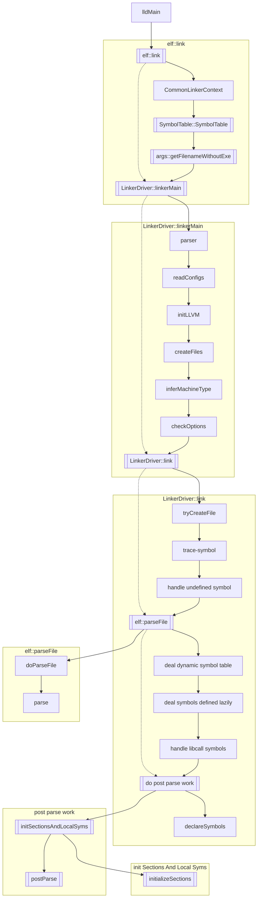
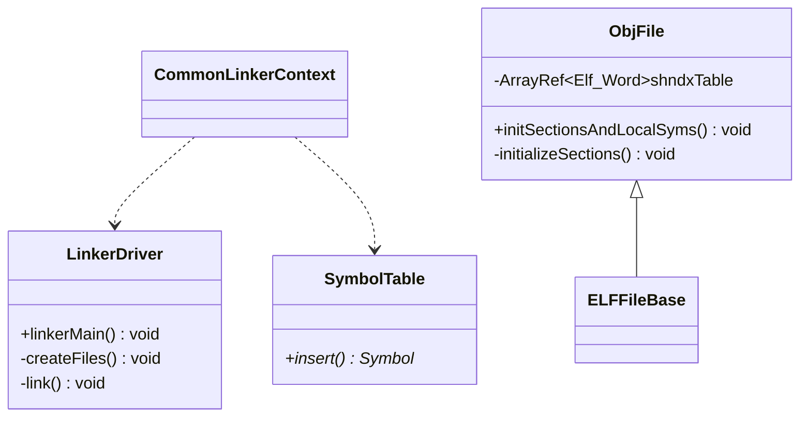

# LLD

LLD 是 llvm 的链接器。下述笔记以 ELF 二进制类型为例。

## 链接时调用关系

调用关系

类图

### elf::link

完成初始化

#### 构建符号表 symtab

`SymbolTable()`

### LinkerDriver::linkerMain

构建 parser

处理 parser

### LinkerDriver::link

#### Create output files

#### Handle --trace-symbol

`symtab.insert()`

#### Handle -u/--undefined before input files

`addUnusedUndefined()`

#### parseFile

Add symbols in File to the symbol table.

调用 `doParseFile()` ，对每类文件一一进行处理

对 Binary File，调用 `BinaryFile::parse()`。为每个二进制文件创建相应符号（`symtab.addAndCheckDuplicate()`）。For each input file foo that is embedded to a result as a binary blob, we define _binary_foo_{start,end,size} symbols, so that user programs can access blobs by name.

#### post parse

Do post parse work like checking duplicate symbols.

`ObjFile<ELFT>::initSectionsAndLocalSyms`

`ObjFile<ELFT>::initializeSections`

## TODO

- [ ] 梳理符号表的处理过程（主要在 parseFile？）
- [ ] `getObjMsg` 的调用时刻，和 `initSectionsAndLocalSyms` 关系？（getObjMsg may be called before ObjFile::initSectionsAndLocalSyms where local symbols are initialized.）
- [ ] ObjFile 类和其他类的关系

## 参考链接
