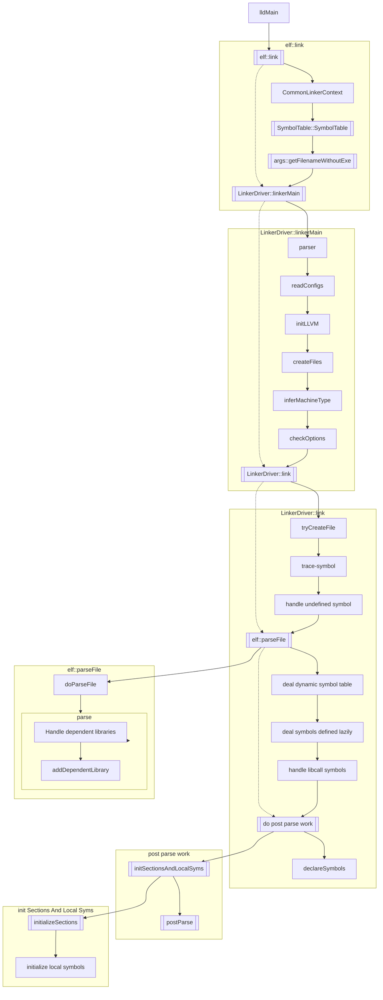
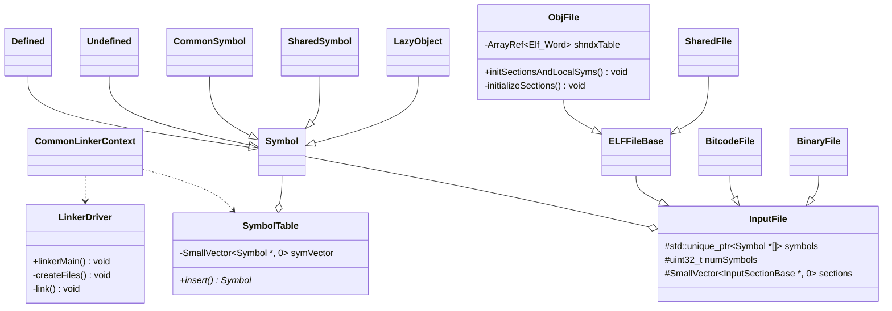

# LLD

LLD 是 llvm 的链接器。下述笔记以 ELF 二进制类型为例。

## 链接时调用关系

调用关系

类图

### elf::link

完成初始化

#### 构建符号表 symtab

`SymbolTable()`

### LinkerDriver::linkerMain

构建 parser

处理 parser

### LinkerDriver::link

#### Create output files

#### Handle --trace-symbol

`symtab.insert()`

#### Handle -u/--undefined before input files

`addUnusedUndefined()`

#### parseFile

Add symbols in File to the symbol table.

调用 `doParseFile()` ，对每类文件一一进行处理

* Binary file
* Lazy object file
* .so file
* LLVM bitcode file
* Regular object file

对 Binary File，调用 `BinaryFile::parse()`。为每个二进制文件创建相应符号（`symtab.addAndCheckDuplicate()`）。For each input file foo that is embedded to a result as a binary blob, we define _binary_foo_{start,end,size} symbols, so that user programs can access blobs by name.

对于 Regular object file，调用 `ObjFile<ELFT>::parse`

1. Read a section table
2. Handle dependent libraries and selection of section groups as these are not done in parallel
   1. Handle SHT_LLVM_DEPENDENT_LIBRARIES sh_type section
   2. Handle SHT_ARM_ATTRIBUTES sh_type section
   3. Handle SHT_GROUP sh_type section
3. Read a symbol table（`ObjFile<ELFT>::initializeSymbols`）

#### post parse

Do post parse work like checking duplicate symbols.

对于 objectFiles

1. `ObjFile<ELFT>::initSectionsAndLocalSyms`
2. postParse

对于 bitcodeFiles

1. postParse

##### 初始化 sections and local symbols

###### `ObjFile<ELFT>::initializeSections`

handle `-r`

handle SHF_LINK_ORDER sections

create SHT_REL[A] sections

###### initialize local symbols

##### postParse

This checks duplicate symbols and may do symbol property merge in the future.

遍历当前文件的符号，将符号放入 `ctx.duplicates` 中

1. 处理 STT_TLS symbol
2. 处理 non-COMMON defined symbol

## TODO

- [ ] 梳理符号表的处理过程（主要在 parseFile？）
- [ ] `getObjMsg` 的调用时刻，和 `initSectionsAndLocalSyms` 关系？（getObjMsg may be called before ObjFile::initSectionsAndLocalSyms where local symbols are initialized.）
- [ ] ObjFile 类和其他类的关系
- [ ] parallelForEach
- [ ] STT_TLS
- [ ] struct Ctx 和 CommonLinkerContext 的关系

## 参考链接
