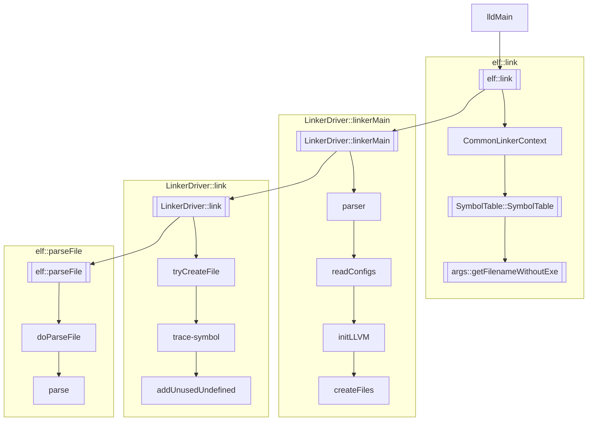
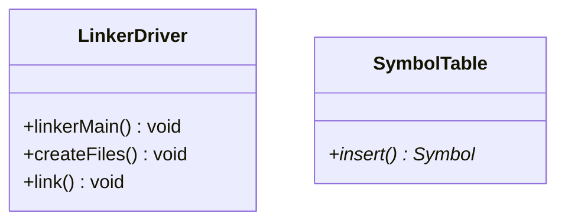

# LLD

LLD 是 llvm 的链接器。下述笔记以 ELF 二进制类型为例。

## 链接时调用关系

调用关系

类图

### elf::link

完成初始化

#### 构建符号表 symtab

`SymbolTable()`

### LinkerDriver::linkerMain

构建 parser

处理 parser

### LinkerDriver::link

#### Create output files

#### Handle --trace-symbol

`symtab.insert()`

#### Handle -u/--undefined before input files

`addUnusedUndefined()`

#### parseFile

调用 `doParseFile()` ，对每个文件进行处理

对 Binary File，调用 `BinaryFile::parse()`

## 参考链接
