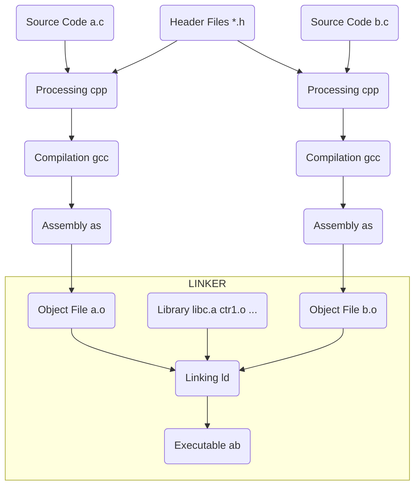

# 多文件链接

## CUDA TOOLKIT

### Separate Compilation

device 相关的编译将分为两部：

1. 将 relocatable device code 编译到对应 host object 中，比如 x.o 和 y.o
2. 使用 nvlink 将 x.o 和 y.o 中的 device code 链接到一起得到 a_dlink.o

之所以称第一步编译的 device code 为 relocatable，意思是说这些 device code 在 host object 的位置会在第二步重定位

对比 Whole Program Compilation，我们称其 device code 为 executable device code，意思是编译后的 device code 在 host object 中已经定位好了，一直到生成可执行文件都是不需要重新定位的

### Virtual and Real Architectures

```bash
nvcc x.cu --gpu-architecture=compute_50 --gpu-code=sm_50
```

compute_xx 就是对应 GPU 的 Virtual Architecture，而 sm_xx 就是对应 GPU 的 Real Architecture。至于后面的数字，代表的是 GPU 不同架构的版本

这里的 Virtual 和 Real 架构其实也是两种不同的指令集，其中 Virtual Architecture 会生成一种中间产物 PTX(Parallel Thread Execution)，可以认为它是 Virtual Architecture 的汇编产物。Virtual Architecture 是一个通用的指令集，主要是为了考虑不同显卡之间的兼容性。Real Architecture 提供的是真实 GPU 上的指令集，也是最终 CUDA 程序运行的指令集。所以一般在选择编译选项的时候，Virtual Architecture 的版本要选择低一些，因为这样可以大大提高兼容性，也就是说可以跑在更多的 CUDA 机器上。而 Real Architecture 尽量使用最新的版本，因为一般来说最新的版本会进行更多的优化

CUDA 程序编译时，首先会根据你指定的 Virtual Architecture 选项生成 .ptx 文件，然后再根据 Real Architecture 的选项将 .ptx 文件编译成 .cubin 文件，最终再经过一系列处理 .cubin 文件会链接到目标产物中

### Just-in-Time Compilation

CUDA 中的 JIT 就是在 CUDA 程序运行时，将 .ptx 文件根据目标平台编译为对应的 .cubin 文件，并链接到目标产物中

## 多个目标文件的链接、静态链接、动态链接

### 链接概述

如下图所示为最基本的静态链接过程示意图。每个模块的源代码文件（如.c）文件经过编译器编译成目标文件（Object File，一般扩展名为.o或.obj）。目标文件和 库（Library）一起链接形成最终的可执行文件

其中，最常见的库就是运行时库（Runtime Library），它是支持程序运行的基本函数的集合。库本质上是一组目标文件的包，由一些最常用的代码编译成目标文件后打包而成



链接过程主要包含了三个步骤：

1. 地址与空间分配（Address and Storage Allocation）
2. 符号解析（Symbol Resolution）
3. 重定位（Relocation）

### 地址与空间分配

对于多个输入目标文件，链接器如何将它们的各个节合并到输出文件呢？或者说，输出文件中的空间如何分配给输入文件

#### 按序叠加

一个最简单的方案就是将输入的文件按序叠加。虽然这种方法非常简单，但是它存在一个问题：在有很多输入文件的情况下，输出文件会有很多零散的节。这种做法非常浪费空间，因为每个节都需要有一定的地址和空间对齐要求。x86硬件的对齐要求是4KB。如果一个节的大小只有1个字节，它也要在内存在重用4KB。这样会造成大量内部碎片

#### 合并相似节

一个更加实际的方法便是合并相同性质的节，比如：将所有输入文件的 .text节合并到输出文件的 text段（注意，此时出现了段和节两个概念）

to be continued...

## 参考文献

1. [NVCC 官方文档](https://docs.nvidia.com/cuda/cuda-compiler-driver-nvcc/index.html#examples)（第六章）
2. [CUDA Binary 官方文档](https://docs.nvidia.com/cuda/cuda-binary-utilities/index.html)
3. [博客 CUDA学习系列(1) | 编译链接篇](https://polobymulberry.github.io/2019/03/04/CUDA%E5%AD%A6%E4%B9%A0%E7%B3%BB%E5%88%97(1)%20%7C%20%E7%BC%96%E8%AF%91%E9%93%BE%E6%8E%A5%E7%AF%87/)
4. [博客 计算机那些事(5)——多个目标文件的链接、静态链接、动态链接](https://blog.csdn.net/jinking01/article/details/105388149)
5. [博客 高级语言的编译：链接及装载过程介绍](https://tech.meituan.com/2015/01/22/linker.html)
