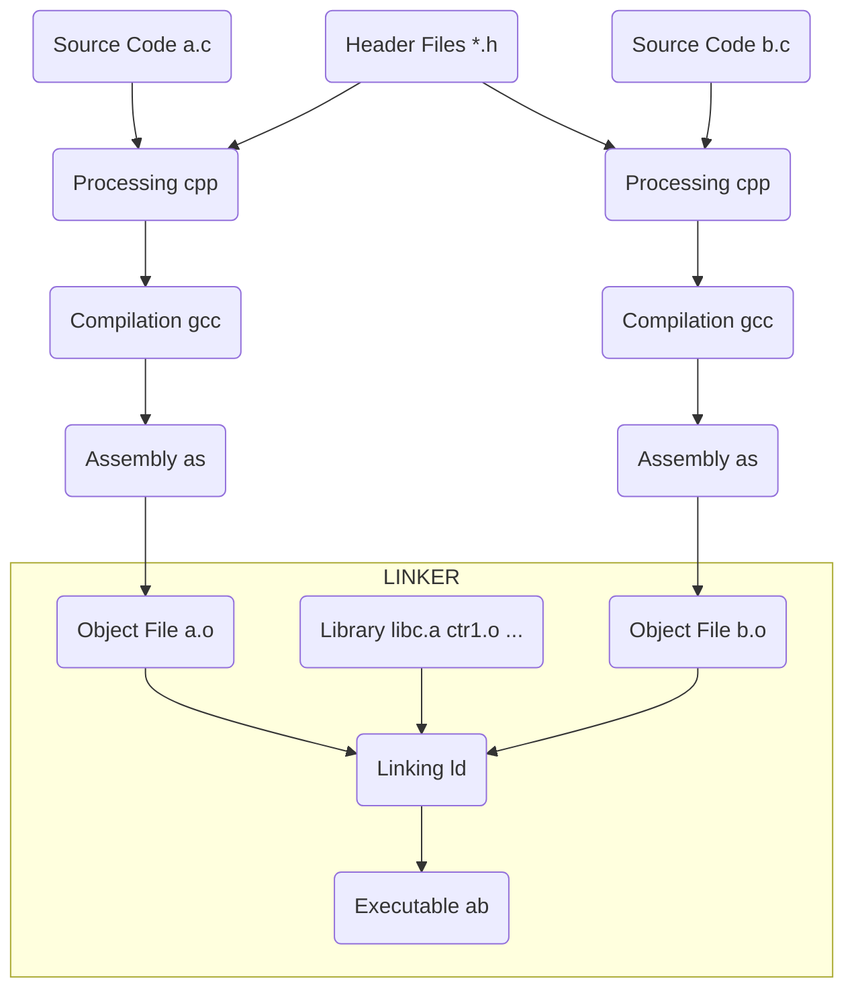

# 多文件链接

## CUDA TOOLKIT

### Separate Compilation

device 相关的编译将分为两部：

1. 将 relocatable device code 编译到对应 host object 中，比如 x.o 和 y.o
2. 使用 nvlink 将 x.o 和 y.o 中的 device code 链接到一起得到 a_dlink.o

之所以称第一步编译的 device code 为 relocatable，意思是说这些 device code 在 host object 的位置会在第二步重定位

对比 Whole Program Compilation，我们称其 device code 为 executable device code，意思是编译后的 device code 在 host object 中已经定位好了，一直到生成可执行文件都是不需要重新定位的

### Virtual and Real Architectures

```bash
nvcc x.cu --gpu-architecture=compute_50 --gpu-code=sm_50
```

compute_xx 就是对应 GPU 的 Virtual Architecture，而 sm_xx 就是对应 GPU 的 Real Architecture。至于后面的数字，代表的是 GPU 不同架构的版本

这里的 Virtual 和 Real 架构其实也是两种不同的指令集，其中 Virtual Architecture 会生成一种中间产物 PTX(Parallel Thread Execution)，可以认为它是 Virtual Architecture 的汇编产物。Virtual Architecture 是一个通用的指令集，主要是为了考虑不同显卡之间的兼容性。Real Architecture 提供的是真实 GPU 上的指令集，也是最终 CUDA 程序运行的指令集。所以一般在选择编译选项的时候，Virtual Architecture 的版本要选择低一些，因为这样可以大大提高兼容性，也就是说可以跑在更多的 CUDA 机器上。而 Real Architecture 尽量使用最新的版本，因为一般来说最新的版本会进行更多的优化

CUDA 程序编译时，首先会根据你指定的 Virtual Architecture 选项生成 .ptx 文件，然后再根据 Real Architecture 的选项将 .ptx 文件编译成 .cubin 文件，最终再经过一系列处理 .cubin 文件会链接到目标产物中

### Just-in-Time Compilation

CUDA 中的 JIT 就是在 CUDA 程序运行时，将 .ptx 文件根据目标平台编译为对应的 .cubin 文件，并链接到目标产物中

## 多个目标文件的链接、静态链接、动态链接

### 链接概述

如下图所示为最基本的静态链接过程示意图。每个模块的源代码文件（如.c）文件经过编译器编译成目标文件（Object File，一般扩展名为.o或.obj）。目标文件和 库（Library）一起链接形成最终的可执行文件

其中，最常见的库就是运行时库（Runtime Library），它是支持程序运行的基本函数的集合。库本质上是一组目标文件的包，由一些最常用的代码编译成目标文件后打包而成



链接过程主要包含了三个步骤：

1. 地址与空间分配（Address and Storage Allocation）
2. 符号解析（Symbol Resolution）
3. 重定位（Relocation）

### 地址与空间分配

对于多个输入目标文件，链接器如何将它们的各个节合并到输出文件呢？或者说，输出文件中的空间如何分配给输入文件

#### 按序叠加

一个最简单的方案就是将输入的文件按序叠加。虽然这种方法非常简单，但是它存在一个问题：在有很多输入文件的情况下，输出文件会有很多零散的节。这种做法非常浪费空间，因为每个节都需要有一定的地址和空间对齐要求。x86硬件的对齐要求是4KB。如果一个节的大小只有1个字节，它也要在内存在重用4KB。这样会造成大量内部碎片

#### 合并相似节

一个更加实际的方法便是合并相同性质的节，比如：将所有输入文件的 .text节合并到输出文件的 text段（注意，此时出现了段和节两个概念）

其中.bss节在目标文件和可执行文件中不占用文件的空间，但是它在装载时占用地址空间。事实上，这里的空间和地址有两层含义:

1. 在输出的可执行文件中的空间
2. 在装载后的虚拟地址中的空间

对于有实际数据的节，如.text和.data，它们在文件中和虚拟地址中都要分配空间，因为它们在这两者中都存在；对于.bss来，分配空间的意义只局限于虚拟地址空间，因为它在文件中并没有内容。**我们在这里谈到的空间分配只关注于虚拟地址空间的分配**，因为这关系到链接器后面的关于地址计算的步骤，而可执行文件本身的空间分配与链接的关系并不大

现在的链接器空间分配的策略基本上都采用“合并相似节”的方法，使用这种方法的链接器一般采用一种叫 **两步链接（Two-pass Linking）** 的方法。即整个链接过程分为两步：

* **第一步 地址与空间分配**

    扫描所有的输入目标文件，获得它们的各个节的长度、属性、位置，并将输入目标文件中的符号表中所有的符号定义和符号引用收集起来，统一放到一个全局的符号表。这一步，链接器能够获得所有输入目标文件的节的长度，并将它们合并，计算出输出文件中各个节合并后的长度与位置，并建立映射关系

* **第二步 符号解析与重定位**

    使用前一步中收集到的所有信息，读取输入文件中节的输入数据、重定位信息，并且进行符号解析与重定位、调整代码、调整代码中的地址等。事实上，第二步是链接过程的核心，尤其是重定位

在地址与空间分配步骤完成之后，相似权限的节会被合并成段，并生成 **程序头表（Program Header Table）** 结构。如下右图可执行文件结构所示，主要生成两个段：代码段（ text段）、数据段（ data段 ）

| Relocatable File ELF | Executable File ELF | |
| :--: | :--: | :-- |
| **ELF Header** | **ELF Header** | 只读内存段（代码段） |
| | **Program Header Table** | 只读内存段（代码段） |
| | Section [.init] | 只读内存段（代码段） |
| Section [.text] | Section [.text] | 只读内存段（代码段） |
| Section [.rodata] | Section [.rodata] | 只读内存段（代码段） |
| Section [.data] | Section [.data] | 读/写内存段（数据段） |
| Section [.bss] | Section [.bss] | 读/写内存段（数据段） |
| Section [.symtab] | Section [.symtab] | 不加载到内存的符号表、调试信息 |
| Section [.rel.text] | |
| Section [.rel.data] | |
| Section [.debug] | Section [.debug] | 不加载到内存的符号表、调试信息 |
| Section [.line] | Section [.line] | 不加载到内存的符号表、调试信息 |
| Section [.strtab] | Section [.strtab] | 不加载到内存的符号表、调试信息 |
| **Section Header Table** | **Section Header Table** | 不加载到内存的符号表、调试信息 |

Program Header Table：将连续的文件节映射到运行时内存段

我们使用ld或gcc将a.o和b.o链接起来，然后使用objdump工具来查看链接前后的地址分配情况

```bash
$ objdump -h a.o

Sections:
Idx Name          Size      VMA               LMA               File off  Algn
  0 .text         0000004f  0000000000000000  0000000000000000  00000040  2**0
                  CONTENTS, ALLOC, LOAD, RELOC, READONLY, CODE
  1 .data         00000000  0000000000000000  0000000000000000  0000008f  2**0
                  CONTENTS, ALLOC, LOAD, DATA
  2 .bss          00000000  0000000000000000  0000000000000000  0000008f  2**0
                  ALLOC
  ...
```

```bash
$ objdump -h b.o

Sections:
Idx Name          Size      VMA               LMA               File off  Algn
  0 .text         0000004b  0000000000000000  0000000000000000  00000040  2**0
                  CONTENTS, ALLOC, LOAD, READONLY, CODE
  1 .data         00000004  0000000000000000  0000000000000000  0000008c  2**2
                  CONTENTS, ALLOC, LOAD, DATA
  2 .bss          00000000  0000000000000000  0000000000000000  00000090  2**0
                  ALLOC
  ...
```

```bash
$ objdump -h ab

Sections:
Idx Name          Size      VMA               LMA               File off  Algn
  ...
  13 .text         00000202  0000000000400450  0000000000400450  00000450  2**4
                  CONTENTS, ALLOC, LOAD, READONLY, CODE
  ...
  24 .data         00000014  0000000000601028  0000000000601028  00001028  2**3
                  CONTENTS, ALLOC, LOAD, DATA
  25 .bss          00000004  000000000060103c  000000000060103c  0000103c  2**0
                  ALLOC
  ...
```

可以发现，链接前目标文件中所有节的 **VMA（Virtual Memory Address）** 都是0，因为虚拟空间还没有分配。链接后，可执行文件 ab 中各个节被分配到了相应的虚拟地址，如`.text`节被分配到了地址0x0000000000400450

那么，为什么链接器要将可执行文件 ab 的`.text`节分配到0x0000000000400450？而不是从虚拟空间的0地址开始分配呢？这涉及到操作系统的进程虚拟地址空间的分配规则。在Linux x86-64系统中，代码段总是从0x0000000000400000开始的，另外`.text`节之前还有`ELF Header、Program Header Table、.init`等占用了一定的空间，所以就被分配到了0x0000000000400450

### 符号解析

在**两步链接**中，这一步和重定位被合并成了一步，这是因为重定位的过程是伴随着符号解析的

链接器解析符号引用的方法是将每个引用与它输入的可重定位目标文件的符号表中的一个确定的符号定义关联起来。对那些和引用定义在相同模块的局部符号的引用，符号解析是非常简单的。编译器只允许每个模块中每个局部符号有一个定义。静态局部变量也会有本地链接器符号，编译器还要确保它们拥有唯一的名字

然而，对于全局符号的解析要复杂得多。当编译器遇到一个不是在当前模块中定义的符号（变量或函数名）时，会假设该符号是在其他某个模块中定义的，生成一个链接器符号表条目，并把它交给链接器处理。如果链接器在它的任何输入模块中都找不到这个被引用符号的定义，就输出一条错误信息并终止

另一方面，对全局符号的解析，经常会面临多个目标文件可能会定义相同名字的全局符号。这种情况下，链接器必须要么标志一个错误，要么以某种方法选出一个定义并抛弃其他定义

#### 多重定义的全局符号解析

链接器的输入是一组可重定位目标模块。每个模块定义一组符号，有些是局部符号（只对定义该符号的模块可见），有些是全局符号（对其他模块也可见）。如果多个模块定义同名的全局符号，该如何进行取舍？

Linux 编译系统采用如下的方法解决多重定义的全局符号解析：

**在编译时，编译器想汇编器输出每个全局符号，或者是强（strong）或者是弱（weak），而汇编器把这个信息隐含地编码在可重定位目标文件的符号表中。**

根据强弱符号的定义，Linux链接器使用下面的规则来处理多重定义的符号名：

* 规则1：不允许有多个同名的强符号
* 规则2：如果有一个强符号和多个弱符号同名，则选择强符号
* 规则3：如果有多个弱符号同名，则从这些弱符号中任意选择一个

另一方面，由于允许一个符号定义在多个文件中，所以可能会导致一个问题：如果一个弱符号定义在多个目标文件中，而它们的类型不同，怎么办？这种情况主要有三种：

* 情况1：两个或两个以上的强符号类型不一致
* 情况2：有一个强符号，其他都是弱符号，出现类型不一致
* 情况3：两个或两个以上弱符号类型不一致

其中，情况1由于多个强符号定义本身就是非法的，所以链接器就会报错。对于后两种情况，编译器和链接器采用一种叫 **COMMON块（Common Block）** 的机制来处理。其过程如下：

**首先，编译器将未初始化的全局变量定义为弱符号处理。对于情况3，最终链接时选择最大的类型。对于情况2，最终输出结果中的符号所占空间与强符号相同，如果链接过程中有弱符号大于强符号，链接器会发出警告**

### 重定位

事实上，重定位过程也伴随着符号的解析过程。链接的前两步完成之后，链接器就已经确定所有符号的虚拟地址了，那么链接器就可以根据符号的地址对每个需要重定位的指令进行地址修正

那么链接器如何知道哪些指令是要被调整的呢？事实上，我们前面提到的ELF文件中的 **重定位表（Relocation Table）** 专门用来保存这些与重定位相关的信息

对于可重定位的 ELF 文件来说，它必须包含重定位表，用来描述如何修改相应的节的内容。对于每个要被重定位的 ELF 节都有一个对应的重定位表。如果`.text`节需要被重定位，则会有一个相对应叫`.rel.text`的节保存了代码节的重定位表；如果`.data`节需要被重定位，则会有一个相对应的`.rel.tdata`的节保存了数据节的重定位表

我们可以使用 objdump 工具来查看目标文件中的重定位表

```bash
$ objdump -r a.o

a.o:     file format elf64-x86-64

RELOCATION RECORDS FOR [.text]:
OFFSET           TYPE              VALUE
0000000000000023 R_X86_64_32       share
0000000000000030 R_X86_64_PC32     swap-0x0000000000000004
0000000000000049 R_X86_64_PC32     __stack_chk_fail-0x0000000000000004


RELOCATION RECORDS FOR [.eh_frame]:
OFFSET           TYPE              VALUE
0000000000000020 R_X86_64_PC32     .text
```

我们可以看到每个要被重定位的地方是一个 **重定位入口（Relocation Entry）**。利用数据结构成员包含的信息，即可完成重定位

## 参考文献

1. [NVCC 官方文档](https://docs.nvidia.com/cuda/cuda-compiler-driver-nvcc/index.html#examples)（第六章）
2. [CUDA Binary 官方文档](https://docs.nvidia.com/cuda/cuda-binary-utilities/index.html)
3. [博客 CUDA学习系列(1) | 编译链接篇](https://polobymulberry.github.io/2019/03/04/CUDA%E5%AD%A6%E4%B9%A0%E7%B3%BB%E5%88%97(1)%20%7C%20%E7%BC%96%E8%AF%91%E9%93%BE%E6%8E%A5%E7%AF%87/)
4. [博客 计算机那些事(5)——多个目标文件的链接、静态链接、动态链接](https://blog.csdn.net/jinking01/article/details/105388149)
5. [博客 高级语言的编译：链接及装载过程介绍](https://tech.meituan.com/2015/01/22/linker.html)
